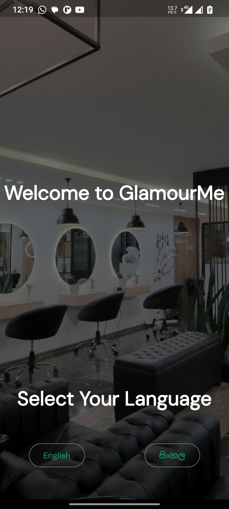
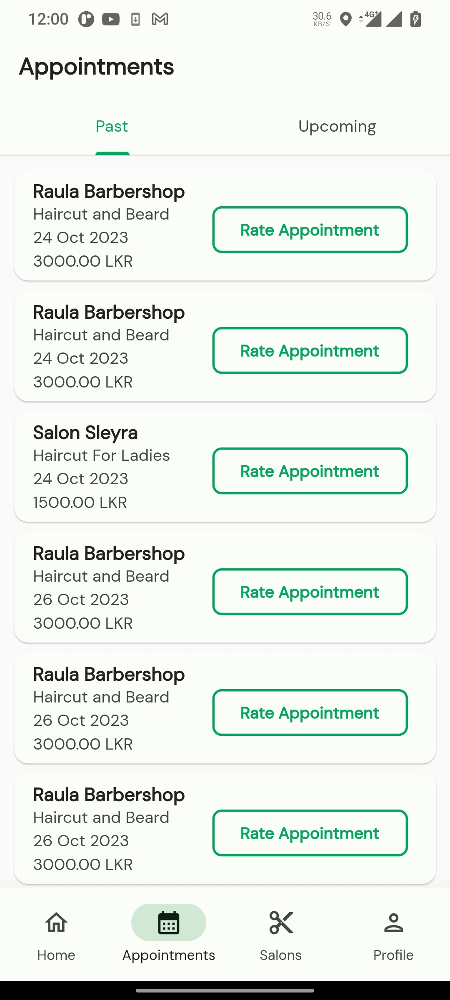
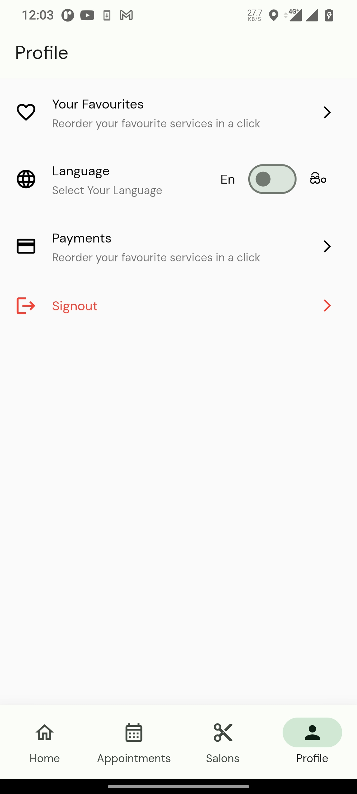

# GlamourMe Client App

## Overview

GlamourMe is a cutting-edge mobile application developed using Flutter and Dart, designed to revolutionize the salon experience for both salon owners and customers in Sri Lanka.

## UI Screenshots

| Onboarding | Login| Signup | Login|
| :---: | :---: | :---: | :---: |
|  |  |  | |

| Home Screen | Nearby Salons | Appointments| Services | 
| :---: | :---: | :---: | :---: |
|  |  | |  |

| Create Appointment | Payment |Profile | Language |
| :---: | :---: | :---: | :---: |
|  |  | |  |


## Tech Stack

- **Flutter**
- **Dart**

## Features

1. **Effortless Booking for Customers:**
   - User-friendly interface for discovering and booking salon appointments.
   - Real-time notifications.

3. **Secure In-App Payment Processing:**
   - Seamless and secure payment transactions within the app.

4. **Multilingual Support:**
   - Supports both Sinhala and English languages for a broader user base.

5. **Geolocation Services:**
   - Integrated maps for easy salon location tracking.

## Instructions to Run Dev Build

1. **Prerequisites:**
   - Make sure you have Flutter installed. If not, follow the instructions [here](https://flutter.dev/docs/get-started/install).

2. **Clone the Repository:**
    ```
    https://github.com/SLIIT-Y3S2/glamourme-client
    ```
3. **Navigate to the Project Directory:** 
    ```
    cd glamourme-client
    ```
4. **Get Dependencies:**
    ```
    flutter pub get
    ```
5. **Run the App:**
    ```
    flutter run
    ```

This will launch the app in debug mode on a connected device or emulator.

6. **Explore and Contribute:**
- Feel free to explore the codebase and contribute to the project.

## Contributors
- Lakmuthu Shavinda
- Vibhashana Ranhinda
- Dineth Jayakody
- Sandaru Madhubhashana
